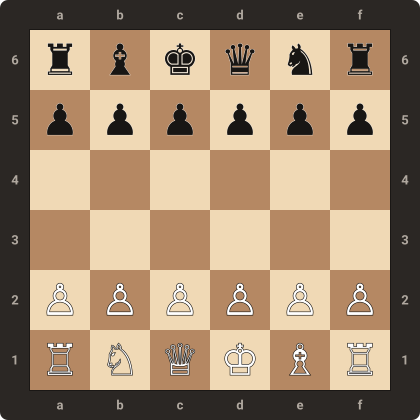

Mini-échecs
-----------

La variante des **Mini-échecs** offre une expérience plus dense et immédiate en transposant les mécaniques des échecs sur un format d'échiquier compact.

Plateau et armée
^^^^^^^^^^^^^^^^

La partie se dispute sur un échiquier de **6×6** cases. Chaque camp dispose initialement d'une armée de 12 pièces :

.. list-table:: Composition de l'armée
   :widths: 15 15 12 12 46
   :header-rows: 1

   * - Pièce
     - Catégorie
     - Quantité
     - Valeur
     - Mouvements et captures
   * - **Roi**
     - Roi
     - 1
     - ∞
     - Déplacement et capture d'une case dans toutes les directions.
   * - **Reine**
     - Tête
     - 1
     - 9
     - Rayons orthogonaux et diagonaux sans limite de portée.
   * - **Tour**
     - Tête
     - 2
     - 5
     - Rayons orthogonaux (lignes et colonnes) sans limite de portée.
   * - **Fou**
     - Tête
     - 1
     - 3
     - Rayons diagonaux sans limite de portée.
   * - **Cavalier**
     - Tête
     - 1
     - 3
     - Sauts en « L » (1, 2) et (2, 1) avec franchissement des pièces intermédiaires.
   * - **Pion**
     - Pion
     - 6
     - 1
     - Déplacement d'une case vers l'avant ; capture d'une case en diagonale avant ; promotion en tête à la dernière rangée.

Disposition initiale
^^^^^^^^^^^^^^^^^^^^

   Disposition initiale de l'échiquier pour la variante Mini Chess.

Les pièces occupent les deux premières rangées de chaque joueur (la disposition du camp adverse étant symétrique par rotation de 180°) :

.. list-table:: Placement initial (camp blanc)
   :widths: 25 75
   :header-rows: 1

   * - Rangée
     - Pièces (de gauche à droite)
   * - **1** (arrière)
     - Tour, Cavalier, Reine, Roi, Fou, Tour
   * - **2** (pions)
     - 6 Pions

Spécificités
^^^^^^^^^^^^

Cette configuration réduite confère au jeu plusieurs particularités :

- **Engagement rapide** : avec seulement deux rangées neutres séparant les armées au départ, le contact entre pièces survient dès les premiers coups ;
- **Asymétrie des têtes légères** : chaque camp ne dispose que d'un seul Fou et d'un seul Cavalier. Le Fou n'évoluant que sur les cases d'une seule couleur, le contrôle de cette diagonale devient particulièrement stratégique ;
- **Promotion accélérée** : les pions atteignent plus rapidement la sixième rangée adverse pour être promus en tête.
